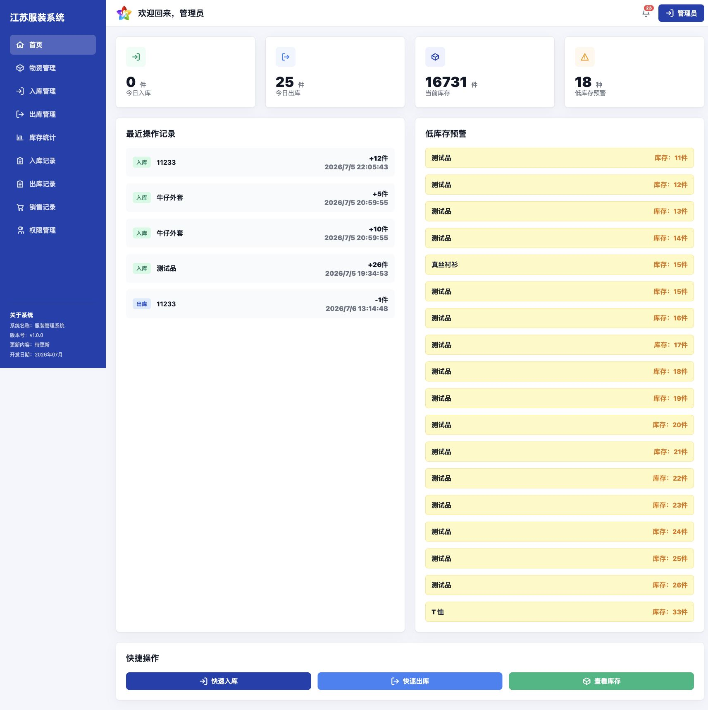

# 服装管理系统

一个面向服装行业进销存场景的轻量级 Web 管理系统，覆盖物资档案、入库登记、出库申请、审核流、库存统计、销售记录、字段级权限控制和数据库维护等常用业务。



## 项目亮点

- **轻量部署**：前端为原生 HTML/CSS/JavaScript，后端使用 Python 标准库 HTTP 服务，数据库使用 SQLite 文件数据库。
- **业务闭环完整**：支持物资建档、Excel 入库、出库申请、审核通过后自动扣库存、销售记录自动生成。
- **权限控制细致**：支持页面级权限和字段级权限，库存金额、销售金额、成本、利润、提成等敏感字段可以按角色控制显示。
- **审核流程贴近业务**：下级提交出库申请后，审核人在申请列表中填写提成并审核，系统自动计算销售利润。
- **筛选和导出**：库存、入库记录、出库记录、销售记录支持品类、规格、尺寸、颜色等筛选，销售记录支持导出。
- **运维方便**：内置二次密码、一键清除业务数据库、修改二次密码等维护功能。

## 技术栈

| 层级 | 技术 |
| --- | --- |
| 前端 | HTML、CSS、原生 JavaScript SPA |
| 后端 | Python 3 标准库 `http.server` |
| 数据库 | SQLite |
| Excel 导入 | Python 解析 `.xlsx` 文件 |
| 部署 | Nginx 反向代理 + systemd 服务 |

## 目录结构

```text
.
├── api_server.py                  # 后端 API 服务
├── app.js                         # 前端单页应用逻辑
├── styles.css                     # 页面样式
├── index.html                     # 入口页面
├── assets/
│   └── system-logo.jpg            # 系统 logo
├── templates/
│   └── inbound-import-template.xlsx
└── docs/
    ├── 功能说明.md
    ├── 部署说明.md
    └── images/
        └── homepage.jpg
```

## 快速启动

本地需要 Python 3。

```bash
python3 api_server.py
```

默认后端地址：

```text
http://127.0.0.1:8301
```

如果只是本地体验，可以用任意静态服务打开前端目录，并把 `/api` 代理到 `127.0.0.1:8301`。生产环境建议使用 Nginx 反向代理，参考 [部署说明](docs/部署说明.md)。

## 默认账号

系统首次初始化会创建演示账号：

| 角色 | 用户名 | 密码 |
| --- | --- | --- |
| 管理员 | `admin` | `123456` |
| 仓库管理员 | `warehouse` | `123456` |
| 普通员工 | `staff` | `123456` |

> 上线后请第一时间修改默认密码和二次密码。

## 主要功能

- 物资管理：新增、编辑、删除物资，维护品名、规格、尺寸、颜色、库存、单价、成本、预警阈值。
- 入库管理：手工入库、Excel 导入、导入预览、自动生成入库记录。
- 出库管理：多物资出库申请、待审核库存占用校验、审核通过/驳回。
- 出库申请列表：每页 10 条，支持审核时填写提成。
- 库存统计：按品类、规格、尺寸、颜色筛选，显示库存金额、成本合计和低库存预警。
- 销售记录：审核通过后自动生成，支持筛选、汇总、导出。
- 权限管理：用户管理、角色权限、字段权限、二次密码和数据库维护。
- 登录安全：独立登录页，错误密码会明确提示。

更多业务细节见 [功能说明](docs/功能说明.md)。

## 数据库说明

系统使用 SQLite，数据库文件默认位于：

```text
data/jiangsu_fuzhuang.sqlite3
```

SQLite 是文件型数据库，不会出现在宝塔 MySQL 数据库列表中。需要宝塔数据库面板管理时，可后续迁移为 MySQL 版本。

## 安全说明

- 仓库不会提交运行时数据库、服务器密码、宝塔面板信息和本地交付报告。
- `.gitignore` 已排除 `data/`、`*.sqlite3`、`DEPLOYMENT_STATUS.md`、`DELIVERY_TEST_REPORT.md` 等本地敏感文件。
- 一键清库功能需要二次密码和确认文字，避免误操作。

## 许可证

当前项目用于客户业务系统交付和内部二次开发，未附加开源许可证。如需开源授权，请按实际商业约定补充 LICENSE。
